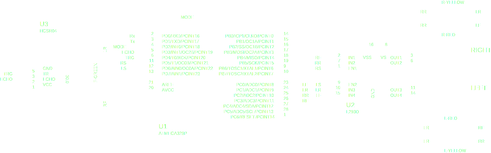

# Autonomous & Remote-Control Car

Obviously, the car have two modes of operation that the user can switch between.

`Autonomous Mode:`  
It is an automatic mode in which the car keeps moving while avoiding obstacles using its on-board ultrasonic sensor that is used to measure the distance.

`Remote-Control Mode:`  
It is a manual mode where the user can control the car movements using its on-board bluetooth module.  
Recommended Remote App: [Bluetooth RC Car](https://play.google.com/store/apps/details?id=braulio.calle.bluetoothRCcontroller)

| Direction     |  Command  |
| :------------ | :-------: |
| Forward       |    `F`    |
| Back          |    `B`    |
| Left          |    `L`    |
| Right         |    `R`    |
| Forward Left  |    `G`    |
| Forward Right |    `I`    |
| Back Left     |    `H`    |
| Back Right    |    `J`    |
| Stop          |    `S`    |
| Speed         | `0` - `9` |
| Max Speed     |    `q`    |

## Schematic



### Components

| Item                     |    Code    | Purpose                                        | Quantity |
| :----------------------- | :--------: | :--------------------------------------------- | :------: |
| Microcontroller          | ATMega328P | The Master Mind                                |    1     |
| USBasp Programmer        |            | Burn The Code on The Controller                |    1     |
| Bluetooth Module         |   HC-05    | Receive Commands From Phone/PC in `RC Mode`    |    1     |
| Ultrasonic Module        |  HC-SR04   | Measure Distance in `Autonomous Mode`          |    1     |
| Motor Driver             |   L293D    | Derive High Currents to The DC Motors          |    1     |
| DC Motors                |   DG01D    | Convert The High Current to a Wheels Rotation  |    2     |
| Wheels                   |            | Move The Car                                   |    2     |
| Batteries 1.5v           |            | The Source of Power                            |    4     |
| Battery Holder (4 Cells) |            | Hold The Batteries                             |    1     |
| Bread Board              |            | Carry (ICs, Wires, Modules)                    |    1     |
| Car Chassis              |            | Carry (Bread Board, Wheels, Motors, Batteries) |    1     |
| Switch                   |            | Switch Between Modes                           |    1     |

## Requirements

For Simulation:
[Proteus 8](https://drive.google.com/file/d/14klePpyCtcBhC-KOPgrHwRtvxZ8HFUhA)

For Development:
[VSCode](https://code.visualstudio.com/download) &
[PlatformIO IDE Extension](https://marketplace.visualstudio.com/items?itemName=platformio.platformio-ide)

## ATMega328P

```text
                              ATMega328P
                             ┍━━━┯━━┯━━━┑
(PCINT14/RESET)          PC6 ┤1  ╰──╯ 28├ PC5   (ADC5/SCL/PCINT13)
(PCINT16/RXD)            PD0 ┤2       27├ PC4   (ADC4/SDA/PCINT12)
(PCINT17/TXD)            PD1 ┤3       26├ PC3   (ADC3/PCINT11)
(PCINT18/INT0)           PD2 ┤4       25├ PC2   (ADC2/PCINT10)
(PCINT19/OC2B/INT1)      PD3 ┤5       24├ PC1   (ADC1/PCINT9)
(PCINT20/XCK/T0)         PD4 ┤6       23├ PC0   (ADC0/PCINT8)
VCC                          ┤7       22├       GND
GND                          ┤8       21├       AREF
(PCINT6/XTAL1/TOSC1)     PB6 ┤9       20├       AVCC
(PCINT7/XTAL2/TOSC2)     PB7 ┤10      19├ PB5   (SCK/PCINT5)
(PCINT21/OC0B/T1)        PD5 ┤11      18├ PB4   (MISO/PCINT4)
(PCINT22/OC0A/AIN0)      PD6 ┤12      17├ PB3   (MOSI/OC2A/PCINT3)
(PCINT23/AIN1)           PD7 ┤13      16├ PB2   (SS/OC1B/PCINT2)
(PCINT0/CLKO/ICP1)       PB0 ┤14      15├ PB1   (OC1A/PCINT1)
                             ┕━━━━━━━━━━┙
```

See Also:

- [ATMega328P Datasheet](http://www.atmel.com/Images/Atmel-42735-8-bit-AVR-Microcontroller-ATMega328-328P_Datasheet.pdf)
- [ATMega328P Cheat Sheet](https://github.com/amirbawab/AVR-cheat-sheet)
